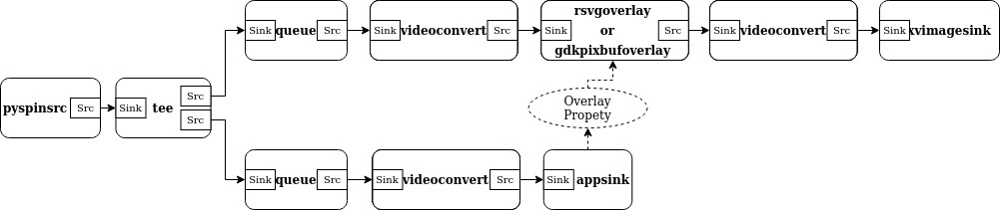
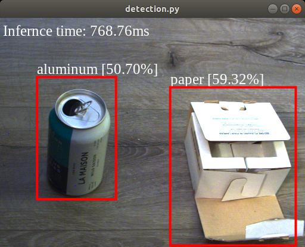
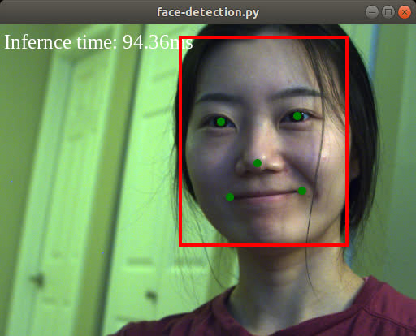
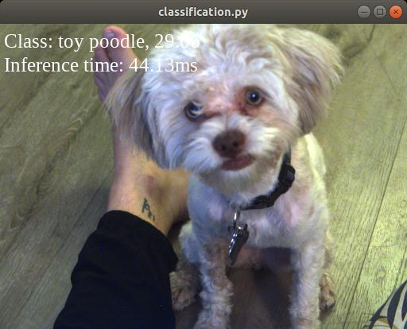
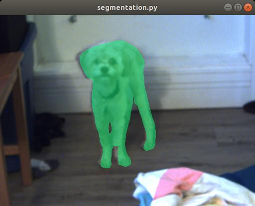

# GStreamer PySpin Src Plug-in

A GStreamer source plug in for the PySpin (spinnaker-python) Image Acquisition SDK  

## Install

#### Spinnaker and PySpin

Download the latest version of **Spinnaker** and the matching version of **PySpin** (spinnaker-python) from:  
https://flir.app.box.com/v/SpinnakerSDK/

#### System dependencies 

Update package manager sources:  

    sudo apt-get update 

Python:  

    sudo apt-get -y install python3.6 python3-pip python3.6-dev python3.6-venv python-dev python3-dev

Build tools:  

    sudo apt-get install -y git build-essential pkg-config libtool autoconf automake libgirepository1.0-dev gir1.2-gstreamer-1.0 libcairo2-dev python-gi-dev

GStreamer:  

    sudo apt-get install -y libgstreamer1.0-0 gstreamer1.0-plugins-base gstreamer1.0-plugins-good gstreamer1.0-plugins-bad gstreamer1.0-plugins-ugly gstreamer1.0-libav gstreamer1.0-doc gstreamer1.0-tools gstreamer1.0-x gstreamer1.0-alsa gstreamer1.0-gl gstreamer1.0-gtk3 gstreamer1.0-qt5 gstreamer1.0-pulseaudio python-gst-1.0 libgstreamer-plugins-base1.0-dev

#### GStreamer pyspinsrc
Clone this repo and install dependencies: 
 
    git clone https://github.com/BrianOfrim/gstreamer-pyspin-src.git
    cd gstreamer-pyspin-src

    python3 -m venv venv
    source venv/bin/activate
    pip install -U wheel pip setuptools Cython

    pip install -r requirements.txt
    pip install <path-to-pyspin-package whl file>

## Usage

Tell GStreamer where our plugin is located:  

    export GST_PLUGIN_PATH=$GST_PLUGIN_PATH:$PWD/venv/lib/gstreamer-1.0/:$PWD/gst/

Verify that the installation was successful and view plug-in info and properties:  

    gst-inspect-1.0 pyspinsrc

Example debugging pipeline:  

    GST_DEBUG=python:6 gst-launch-1.0 --gst-disable-segtrap --gst-disable-registry-fork pyspinsrc ! videoconvert ! xvimagesink sync=false

Example pileline:  

    gst-launch-1.0 pyspinsrc ! videoconvert ! xvimagesink sync=false

## Benchmarks
Streaming and saving video on an Nvidia Jetson Nano using hardware or software video encoding: [Jetson Nano Benchmarks](nvidia-jetson-nano-benchmarks.md)

Streaming and saving video on an Laptop with an Intel i5 CPU using hardware (vaapi) or software encoding: [VAAPI Benchmarks](vaapi-benchmarks.md)

## Use Cases
Streaming video over a network using HLS, and RTP: [Network Streaming](local-network-streaming.md)

Preforming object detection on an edge device and streaming an augmented video feed to a remote monitoring device: [Detection Stream](edge-inference-remote-monitoring.md)

## Examples
Examples require Pillow pytorch and torchvision.   

Install Pillow:

    pip install Pillow

Install pytorch and torchvision:  

    pip install torch torchvision

Note: for arm platforms torch and torchvision may not be available through pip. So you may need to find an alternative installation method. For example with Nvidia Jetson devices follow the instructions here: https://elinux.org/Jetson_Zoo 

The following examples use the same pipeline created in [application/gst_overlay_pipeline.py] and supply different image processing functions.

Example Application pipeline:

### Object detection
Location: **applications/detection.py**  
Recycling detection trained with the [Boja](https://github.com/BrianOfrim/boja) process  
  

### Face Detection
Location: **applications/face-detection.py**  
Face Detection model from https://github.com/timesler/facenet-pytorch  
Requires python module: facenet-pytorch (pip install facenet-pytorch)  
  

### Classification
Location: **applications/classification.py**  
Apply a torchvision pretrained classification model  
  

### Segmentation
Location: **applications/segmentation.py**  
Apply a torchvision pretrained segmentation model  

### Detr Detection
Location: **applications/detr-detection.py**  
Apply a pretrained [detr](https://github.com/facebookresearch/detr) detection model  

## References
Uses the following for gst buffer to numpy mapping utilities and to install [gst-python](https://github.com/GStreamer/gst-python):  
https://github.com/jackersson/gstreamer-python

Object Detection example inspired by:  
https://github.com/google-coral/examples-camera/tree/master/gstreamer
